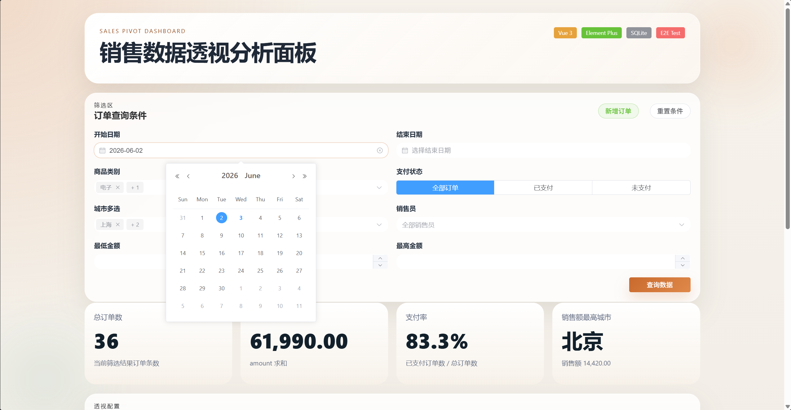
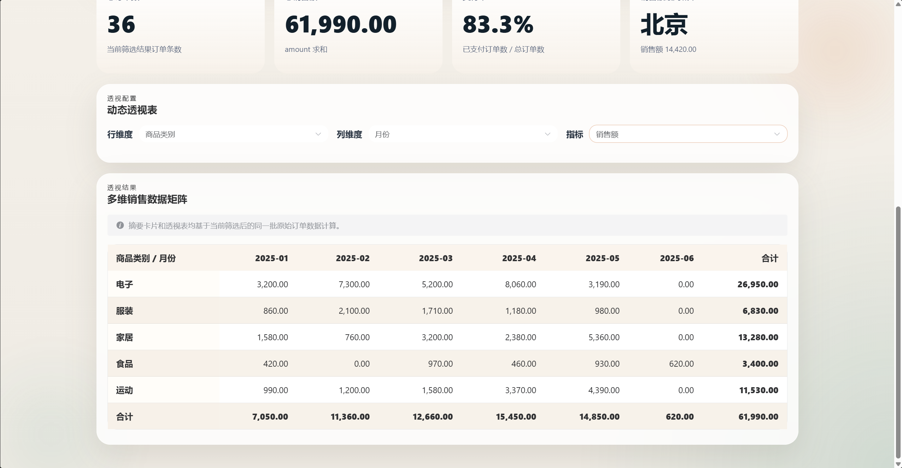
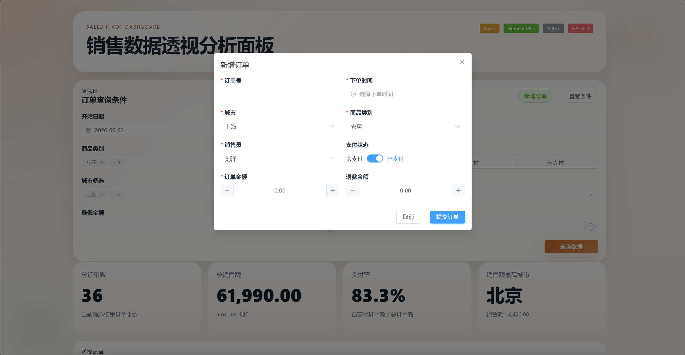

# 销售数据透视分析面板

一个完整可运行的前后端项目。后端使用 Python + SQLite，前端使用 Vue 3 + Element Plus，实现订单查询、摘要卡片、动态透视表、新增订单和 E2E 测试代码。

## 技术栈

- 前端：Vue 3、Vite、Element Plus
- 后端：Python 3 标准库（`http.server`、`sqlite3`）
- 数据库：SQLite
- 测试：Playwright E2E

## 项目结构

```text
project/
├── README.md
├── package.json
├── package-lock.json
├── vite.config.js
├── playwright.config.js
├── server.py
├── database/
│   ├── init.sql
│   └── orders.db
├── frontend/
│   ├── index.html
│   ├── dist/
│   └── src/
│       ├── App.vue
│       ├── api.js
│       ├── constants.js
│       ├── main.js
│       ├── styles.css
│       ├── components/
│       └── utils/
├── tests/
│   └── e2e/
│       └── dashboard.spec.js
├── image.png
├── image-1.png
└── image-2.png
```

## 环境要求

- Python 3.9 及以上
- Node.js 20 及以上
- npm 10 及以上

## 安装依赖

```bash
npm install
```

## 如何启动前端

开发模式：

```bash
npm run dev
```

访问地址：

```text
http://127.0.0.1:5173
```

说明：

- `Vite` 开发服务器会把 `/api` 代理到 `http://127.0.0.1:8000`
- 启动前请先启动后端服务

## 如何启动后端

```bash
python server.py
```

访问地址：

```text
http://127.0.0.1:8000
```

说明：

- 后端会优先托管 `frontend/dist`
- 如果没有构建产物，会回退到 `frontend` 目录

## 生产构建

```bash
npm run build
```

构建完成后，`frontend/dist` 会生成前端静态资源，直接由 `python server.py` 提供访问。

## 数据库如何初始化

- `server.py` 启动时会自动建表
- 如果 `database/orders.db` 不存在，会自动创建
- 如果 `orders` 表为空，会自动插入 36 条测试数据
- `database/init.sql` 保留了初始化脚本，方便手工执行或查阅

## 后端接口

### `GET /api/orders`

支持参数：

- `startDate`：开始日期，格式 `YYYY-MM-DD`
- `endDate`：结束日期，格式 `YYYY-MM-DD`
- `cities`：多个城市用英文逗号分隔，例如 `北京,上海`
- `category`：单个商品类别
- `categories`：多个商品类别，英文逗号分隔
- `salespeople`：多个销售员，英文逗号分隔
- `paidOnly`：`true` 或 `1` 表示只看已支付订单
- `paymentStatus`：`paid` 或 `unpaid`
- `minAmount`：最低金额
- `maxAmount`：最高金额

返回原始订单明细，由前端完成透视、聚合、合计和格式化。

### `GET /api/meta`

返回城市、商品类别、销售员列表，供前端初始化筛选项。

### `POST /api/orders`

新增订单。

请求体示例：

```json
{
  "order_no": "ORD-100001",
  "city": "深圳",
  "category": "电子",
  "salesperson": "测试员",
  "amount": 1888.5,
  "refund_amount": 88.5,
  "is_paid": 1,
  "created_at": "2025-06-15 10:10:10"
}
```

校验规则：

- `order_no` / `city` / `category` / `salesperson` / `created_at` 必填
- `amount`、`refund_amount` 必须为大于等于 0 的数字
- `refund_amount` 不能大于 `amount`
- `is_paid` 只允许 `0` 或 `1`
- `created_at` 支持 `YYYY-MM-DD` 或 `YYYY-MM-DD HH:mm:ss`
- `order_no` 不能重复

## 页面功能

### 1. 筛选区

- 日期范围筛选
- 城市多选
- 商品类别多选
- 销售员多选
- 支付状态筛选
- 最低金额 / 最高金额筛选
- 查询按钮
- 重置按钮
- 新增订单按钮

### 2. 摘要卡片区

- 总订单数
- 总销售额
- 支付率
- 销售额最高城市

### 3. 透视表配置区

- 行维度：城市 / 商品类别 / 销售员
- 列维度：月份 / 支付状态
- 指标：订单数 / 销售额 / 净销售额 / 平均客单价

### 4. 透视表能力

- 缺失月份自动补齐
- 缺失值补 0
- 行合计
- 列合计
- 总计
- 金额保留两位小数
- 百分比格式化
- 列较多时横向滚动
- 表头吸顶
- 首列固定
- 奇偶行区分底色
- 移动端基础可用
- Loading / Empty / Error 状态

## E2E 测试

项目已经提供 Playwright E2E 测试代码：

```bash
npm run test:e2e
```

说明：

- 当前仓库保留测试代码和配置
- 浏览器运行时可以由你本地环境或 VS Code Playwright 插件执行

测试文件：

- `tests/e2e/dashboard.spec.js`

## 本次已完成的加分项

### 数据逻辑类

- 自动补全缺失月份
- 平均客单价计算口径清晰且正确
- 摘要卡片与透视表统计口径一致
- 支持更多筛选组合

### 后端类

- SQL 使用参数化查询
- 启动时自动建表和插入测试数据
- 提供新增订单接口
- 对接口参数进行校验

### UI 交互类

- Loading 状态
- Empty 状态
- Error 状态
- 表格横向滚动
- 表头吸顶
- 首列固定
- 移动端布局基本可用
- 数字、金额、百分比格式化

### 工程质量类

- 数据处理逻辑抽成独立函数
- 组件拆分合理
- 命名清晰
- 避免重复计算
- 使用 `computed` 做缓存计算
- 有测试代码

## 快速启动顺序

1. 安装依赖

```bash
npm install
```

2. 启动后端

```bash
python server.py
```

3. 启动前端开发环境

```bash
npm run dev
```

4. 浏览器访问

```text
http://127.0.0.1:5173
```

如果只看构建产物，也可以：

1. `npm run build`
2. `python server.py`
3. 打开 `http://127.0.0.1:8000`

## 页面截图






